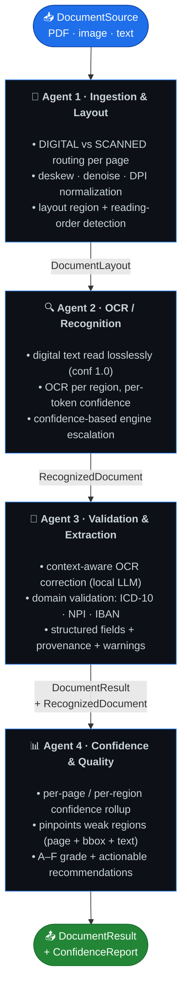
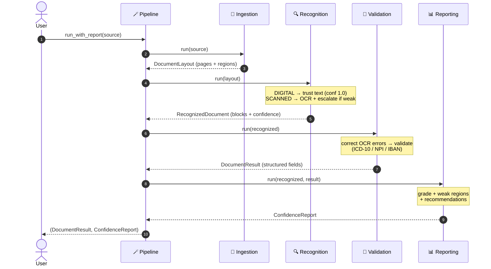
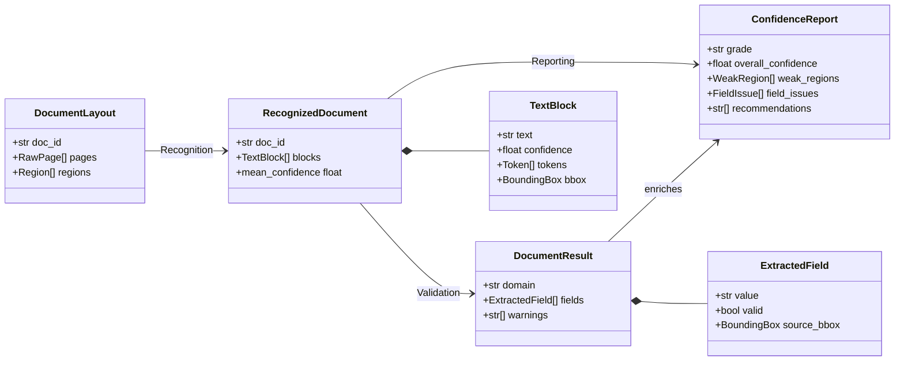
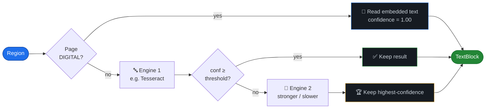

<div align="center">

# 🧠📄 Agentic Document Intelligence

### A local-first, multi-agent OCR system for optimized document understanding

*Built for regulated domains — **healthcare** & **finance** — where document data must never leave the premises.*

<br/>

[](https://www.python.org/)
[](#-quality--testing)
[](#-quality--testing)
[](#-why-this-design)
[-orange?logo=ollama&logoColor=white)](#-swapping-in-real-engines)
[](#-license)

</div>

---

## 📌 Overview

**Agentic Document Intelligence** extracts clean, validated, *structured* data from PDFs and
scanned images — turning unstructured paper into trustworthy JSON. It is composed of **four small,
single-purpose agents** wired together through strict, typed contracts. Each agent does one job
well, is independently testable, and can be swapped without touching the others.

> 🔒 **Everything runs on-prem.** No cloud calls, no API keys, no data egress — the design
> constraint that makes it safe for PHI (HIPAA) and financial records.

<table>
<tr>
<td width="50%" valign="top">

#### ❌ Naïve OCR
```text
"Patient. Jane Doe  MRN OO123456
NPl: l234567893  Dx EllI9..."
```
*Raw characters. Errors baked in. No
structure, no validation, no idea
which parts to trust.*

</td>
<td width="50%" valign="top">

#### ✅ This system
```json
{
  "mrn":  { "value": "00123456", "valid": true },
  "npi":  { "value": "1234567893", "valid": true },
  "dx":   { "value": "E11.9", "valid": true },
  "grade": "A", "confidence": 0.98
}
```
*Corrected, validated, scored, with
provenance back to the page.*

</td>
</tr>
</table>

---

## 🏗️ Architecture

Four agents form a directed pipeline. Typed Pydantic contracts (the labels on the arrows) are the
only thing they share — that's what keeps each one swappable.



<details>
<summary><b>🔁 Sequence view — how a request flows through the agents</b></summary>



</details>

<details>
<summary><b>🧬 Data contracts — the typed models passed between agents</b></summary>



</details>

---

## 💡 Why this design

| Principle | What it means in practice |
| :-- | :-- |
| 🎯 **Cost where it matters** | Digital PDF text is extracted *losslessly* — we never pay OCR error or compute on pages that don't need it. Only true scans hit the OCR engine. |
| ⚡ **Pay for hard regions only** | Recognition runs an ensemble with **confidence-based escalation**: a cheap engine first, a stronger one *only* when a block comes back weak. |
| 🧪 **Domain-aware validation** | Output is checked against real rules — ICD-10 format, **NPI Luhn checksum**, **IBAN mod-97** — so structurally impossible values are flagged, not silently passed on. |
| 🧾 **Auditable by design** | Every value keeps provenance (**bounding box + confidence**); every run emits a per-agent trace — essential for regulated data. |
| 📊 **Knows where it's weak** | A dedicated agent grades each document and pinpoints which pages/regions/fields are low-confidence, with concrete next steps. |
| 🔒 **Fully local** | No cloud, no keys. Optional LLM correction runs against a local model (Ollama) or a deterministic rule-based fallback. |

---

## ⚙️ The confidence escalation engine

The recognition agent's core trick — spend the expensive path only when it's worth it:



---

## 🚀 Install

```bash
# Base — runs the full pipeline out of the box with the built-in MockOCREngine
# (zero native dependencies).
pip install -e .

# Real local OCR (Tesseract + poppler + OpenCV). Needs the `tesseract` binary.
pip install -e ".[ocr]"

# Dev tooling (pytest, ruff)
pip install -e ".[dev]"
```

---

## 🧑‍💻 Usage

### Library

```python
from adi import DocumentIntelligencePipeline

pipeline = DocumentIntelligencePipeline(domain="healthcare")
result = pipeline.process_file("discharge.pdf")

for f in result.fields:
    status = "✓" if f.valid else f"✗ {f.validation_error}"
    print(f"{f.name:24} {f.value:20} {status}")
```

### 📊 Confidence / quality report — *"where is OCR lacking?"*

```python
result, report = pipeline.run_with_report(
    DocumentSource(doc_id="scan", path="scan.png")
)

print(report.grade)               # 'A' … 'F'
print(report.overall_confidence)  # 0.0 … 1.0

for region in report.weak_regions:        # worst-first
    print(region.page_no, region.bbox, region.confidence, region.weak_tokens)
for fi in report.field_issues:            # low-confidence or invalid fields
    print(fi.name, fi.reason)
for rec in report.recommendations:        # actionable next steps
    print(rec)
```

<details>
<summary><b>📋 Example report output</b></summary>

```text
OCR confidence report
  grade        : C
  confidence   : 0.71
  weak blocks  : 3/9 (threshold 0.75)
  per page:
    page 0: conf=0.94  weak=0/4
    page 1: conf=0.52  weak=3/5
  weak regions (worst first):
    [0.41] @page1[120,880] table: "Total 1O.OO  Tax —"  culprits=['1O.OO']
    [0.58] @page1[120,610] key_value: "Acct: GB82 WE5T ..."  culprits=['WE5T']
  fields to review:
    - total_amount='10.00': low confidence (0.41)
  recommendations:
    * Page 1: 3/5 regions are low-confidence — rescan at higher DPI (≥300)
      or improve deskew/denoise.
    * Field 'total_amount' extracted at low confidence — verify against source.
```

> The grade **blends mean confidence with how much of the document is weak**, so a
> high average can't hide a document where a large fraction of regions are shaky.

</details>

### CLI

```bash
ocr-extract discharge.pdf --domain healthcare
ocr-extract invoice.pdf   --domain finance --json out.json --trace
ocr-extract scan.pdf      --domain healthcare --report --report-json report.json
echo "MRN: 0O123456" | ocr-extract --text - --domain healthcare
ocr-extract --list-domains
```

> 💡 The CLI **exits non-zero** if any extracted field fails validation, so it composes cleanly into scripts and CI.

### Demo (no native deps required)

```bash
python examples/run_demo.py
```

Shows a digital extraction, a *scanned* document where OCR noise
(`0O123456 → 00123456`, `l234567893 → 1234567893`) is automatically repaired,
and a finance invoice with IBAN checksum validation + confidence report.

---

## 🔌 Swapping in real engines

Everything pluggable hides behind a small `Protocol`, so going from skeleton to production is incremental — **nothing else in the pipeline changes**.

| Concern | 🧪 Skeleton default | 🏭 Production drop-in |
| :-- | :-- | :-- |
| **OCR engine** | `MockOCREngine` | `TesseractEngine` (or your own `OCREngine`) |
| **OCR correction** | `LocalRuleCorrector` | `OllamaCorrector` (any local `LLMClient`) |
| **Domain rules** | `healthcare` / `finance` | add a module under `adi/schemas/` + register it |

```python
from adi import DocumentIntelligencePipeline
from adi.engines import TesseractEngine, MockOCREngine
from adi.llm import OllamaCorrector

pipeline = DocumentIntelligencePipeline(
    domain="finance",
    engines=[TesseractEngine(), MockOCREngine()],   # escalation fallback chain
    corrector=OllamaCorrector(model="llama3.1"),     # local model, falls back if down
)
```

---

## 📁 Project layout

```text
src/adi/
├── contracts.py        # 🧬 typed models passed between agents (the backbone)
├── pipeline.py         # 🪄 orchestrator wiring the 4 agents together
├── cli.py              # ⌨️  `ocr-extract` entry point
├── agents/             # 🤖 ingestion · recognition · validation · reporting
├── engines/            # 🔍 OCR backends: mock + tesseract (pluggable)
├── llm/                # 🧠 local correctors: rule-based + ollama (pluggable)
└── schemas/            # 📐 domain field specs + validators (healthcare, finance)
tests/                  # ✅ unit + end-to-end tests (33, all local)
examples/run_demo.py    # ▶️  zero-dependency demo
```

---

## 🧩 Built-in domains & validators

| Domain | Fields | Real validation rules |
| :-- | :-- | :-- |
| 🏥 **healthcare** | patient name, DOB, MRN, NPI, diagnosis | ICD-10 format · **NPI Luhn checksum** · date/MRN shape |
| 💰 **finance** | IBAN, total amount, invoice date | **IBAN mod-97 checksum** · currency/amount · date shape |
| 📄 **generic** | *(extensible)* | — |

### ➕ Adding a new domain

Create `src/adi/schemas/<domain>.py` with a `SCHEMA = DomainSchema(...)` of `FieldSpec`s
(locating regex + format hint + validator), register it in `schemas/__init__._REGISTRY`, and it's
immediately available via `DocumentIntelligencePipeline(domain="<domain>")` and the CLI. **No agent
code changes.**

---

## ✅ Quality & testing

```bash
pytest -q              # 33 tests, fully offline
ruff check src tests   # clean
```

| | |
| :-- | :-- |
| **Tests** | 33 passing — unit (agents, validators, corrector) + end-to-end pipeline |
| **Lint** | `ruff` clean |
| **Dependencies** | 1 required (`pydantic`); OCR/LLM backends are optional extras |
| **Offline** | the entire test suite and demo run with zero network access |

---

## 📜 License

MIT — see the project metadata in `pyproject.toml`.

<div align="center">
<sub>Built as a privacy-first reference architecture for agentic OCR. Swap the mock engine for Tesseract and you have a production-shaped pipeline.</sub>
</div>
