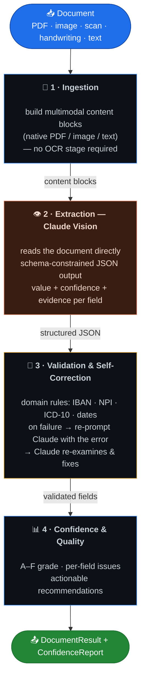
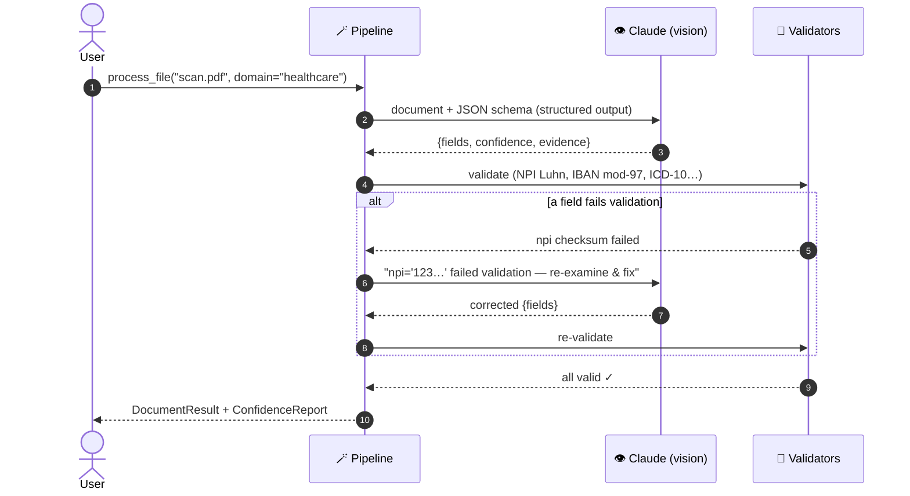
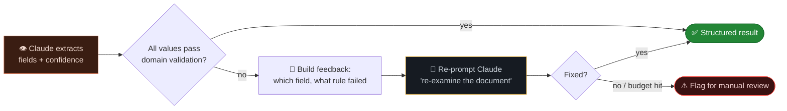

<div align="center">

# 🧠📄 Agentic Document Intelligence

### An AI-native, self-correcting document extraction engine — powered by Claude vision

*Turn any document — scanned, photographed, or **handwritten**, in any layout or language — into clean, validated, structured JSON.*

<br/>

[](https://www.python.org/)
[](https://www.anthropic.com/claude)
[](#-why-this-beats-ocrregex-and-raw-llm-calls)
[](#-quality--testing)
[](#-quality--testing)
[](#-the-self-correction-loop)

</div>

---

## 📌 What this is

A multi-agent system that reads documents the way a human expert would: it **looks at the page**, understands the content semantically, extracts the fields you care about, **checks its own work against real domain rules**, and fixes its mistakes — returning structured JSON with per-field confidence and evidence.

It is built around **Claude vision** (model `claude-opus-4-8`) as the recognition + reasoning engine, wrapped in an agentic loop that makes it *reliable*, not just smart.

> **Two engines, one interface.** The flagship path is **AI-native (Claude)**. A fully-local **OCR fallback** (Tesseract + on-prem rules) ships alongside it for air-gapped/compliance scenarios — same schemas, same typed outputs.

<table>
<tr>
<td width="50%" valign="top">

#### ❌ OCR + regex (the naïve way)
```text
Name: MORGAN, ALICE
DOB: 03/15/1962
```
A rigid extractor looks for the literal label
`Patient Name:` followed by a Titlecase name
and a `YYYY-MM-DD` date.
**Result: 0 fields.** Different label order,
different date format → it breaks. Handwriting?
Hopeless.

</td>
<td width="50%" valign="top">

#### ✅ Agentic Document Intelligence
```json
{
  "patient_name": {"value": "Alice Morgan",
                   "confidence": 0.96,
                   "evidence": "MORGAN, ALICE"},
  "dob":  {"value": "1962-03-15", "confidence": 0.95},
  "npi":  {"value": "1234567893", "valid": true},
  "grade": "A"
}
```
Reads by **meaning**, normalizes the date, keeps
provenance, validates the NPI checksum.

</td>
</tr>
</table>

*(This is a real run on the sample fax document — semantic normalization that regex fundamentally cannot do.)*

---

## 🏗️ Architecture

Four agents, connected through strict typed contracts. The **Extraction agent is Claude vision**; the others make it production-grade.



<details>
<summary><b>🔁 Sequence view — a single extraction with self-correction</b></summary>



</details>

---

## 🔁 The self-correction loop

This is what separates a **reliable system** from *"I piped a PDF into an LLM."* Every value is checked against real domain rules; failures are fed back to Claude with the specific error, and Claude reasons over its own output to fix it.



> The loop is **bounded** (`max_corrections`, default 2) and only re-prompts for *present-but-invalid* values — a genuinely absent field is reported, not hallucinated into existence.

---

## 💡 Why this beats OCR/regex *and* raw LLM calls

| | OCR + regex | Raw LLM call | **This system** |
| :-- | :-: | :-: | :-: |
| Handles any layout / handwriting | ❌ | ✅ | ✅ |
| Semantic field understanding (no fixed labels) | ❌ | ✅ | ✅ |
| Guaranteed-parseable output (JSON schema) | ⚠️ | ⚠️ | ✅ |
| **Validates against domain rules** (IBAN/NPI/ICD-10) | ⚠️ | ❌ | ✅ |
| **Self-corrects** on validation failure | ❌ | ❌ | ✅ |
| Per-field confidence + evidence (provenance) | ❌ | ⚠️ | ✅ |
| Quality grade + manual-review routing | ❌ | ❌ | ✅ |
| High-volume async (50% cost via Batch API) | n/a | ⚠️ | ✅ |

**vs. AWS Textract / Google Document AI:** those return generic key-value pairs and *cannot tell you a checksum is wrong*. This system validates structurally-impossible values, self-corrects, and is fully schema-driven and extensible — you own the logic, not a vendor's black box.

---

## 🚀 Quickstart

```bash
pip install -e ".[ai]"          # installs the Anthropic SDK
export ANTHROPIC_API_KEY=sk-ant-...

ocr-extract teste.pdf --ai --domain healthcare --report
```

```python
from adi.ai import ClaudeDocumentIntelligence

pipeline = ClaudeDocumentIntelligence(domain="healthcare")   # model: claude-opus-4-8
result, report = pipeline.process_file("discharge.pdf")

for f in result.fields:
    flag = "✓" if f.valid else f"✗ {f.validation_error}"
    print(f"{f.name:24} {f.value:20} {flag}   (conf {f.confidence:.2f})")

print("grade:", report.grade)
for rec in report.recommendations:
    print(" •", rec)
```

---

## 🧑‍💻 Usage

### Extract from a PDF, image, or scan

```python
from adi.ai import ClaudeDocumentIntelligence

pipe = ClaudeDocumentIntelligence(domain="finance")
result, report = pipe.process_file("invoice.png")   # PDF, PNG/JPG/GIF/WebP, or text
```

Claude ingests the file **natively** — `.pdf` becomes a document block, images become vision blocks. There is no OCR step to mis-read characters.

### Structured, schema-constrained output

Each domain's fields become a strict JSON schema, so the response is **guaranteed** to be valid JSON with every field present:

```jsonc
{
  "patient_name": { "value": "Alice Morgan", "confidence": 0.96, "evidence": "MORGAN, ALICE" },
  "dob":          { "value": "1962-03-15",   "confidence": 0.95, "evidence": "DOB: 03/15/1962" },
  "npi":          { "value": "1234567893",      "confidence": 0.90, "evidence": "NPI 1234567893" }
}
```

Values flow into validators (NPI Luhn, IBAN mod-97, ICD-10, date formats); failures trigger the self-correction loop.

### High-volume extraction (Batch API — 50% cost)

For thousands of documents a day, submit a batch — same schema, same cached system prompt, processed asynchronously:

```python
from adi.ai import ClaudeClient, BatchItem, extract_batch
from adi.schemas import get_schema

client = ClaudeClient()                       # claude-opus-4-8
items  = [BatchItem(doc_id=f"inv-{i}", path=p) for i, p in enumerate(pdf_paths)]

results = extract_batch(client, get_schema("finance"), items)   # {doc_id: DocumentResult}
for doc_id, res in results.items():
    print(doc_id, res.mean_confidence, [f.name for f in res.fields if not f.valid])
```

### CLI

```bash
ocr-extract scan.pdf       --ai --domain healthcare --report
ocr-extract invoice.pdf    --ai --domain finance --json out.json
ocr-extract handwritten.jpg --ai --domain healthcare --model claude-opus-4-8 --trace
```

> Exits non-zero if any field fails validation — composes cleanly into CI/automation.

---

## ⚙️ Engineering details that matter

| Feature | How it's used |
| :-- | :-- |
| **Vision input** | PDFs and images go to Claude as native document/image blocks — the model *is* the OCR engine, so scans and handwriting Just Work. |
| **Structured outputs** | `output_config.format` with a per-domain JSON schema → guaranteed parseable, complete responses. |
| **Adaptive thinking** | `thinking: {type: "adaptive"}` + `effort: high` — Claude reasons as much as each document needs. |
| **Prompt caching** | The system prompt is marked `cache_control: ephemeral` so repeated extractions reuse the cached prefix (~0.1× cost). |
| **Batch API** | `extract_batch` for asynchronous high-volume runs at 50% token cost. |
| **Injectable client** | The agent takes a client object, so the **entire test suite runs offline** — no SDK, no API key. |

---

## 🔒 Local / offline fallback engine

When data cannot leave the premises (air-gapped, strict compliance), the same interface runs fully on-prem with Tesseract OCR + deterministic validators — no API key, no egress:

```python
from adi import DocumentIntelligencePipeline      # local OCR engine
pipe = DocumentIntelligencePipeline(domain="healthcare")
result, report = pipe.run_with_report(source)
```

| | ☁️ AI engine (Claude) | 🏠 Local engine (OCR) |
| :-- | :-- | :-- |
| Accuracy on hard/handwritten docs | **Excellent** | Limited by OCR |
| Semantic / label-free extraction | ✅ | ❌ (regex) |
| Self-correction | ✅ | — |
| Data leaves the premises | Yes (Anthropic API) | **No** |
| Needs API key | Yes | No |

---

## 🧩 Built-in domains & validators

| Domain | Fields | Real validation rules |
| :-- | :-- | :-- |
| 🏥 **healthcare** | patient name, DOB, MRN, NPI, diagnosis | ICD-10 format · **NPI Luhn checksum** · date/MRN shape |
| 💰 **finance** | IBAN, total amount, invoice date | **IBAN mod-97 checksum** · currency/amount · date shape |
| 📄 **generic** | *(extensible)* | — |

**Add a domain** in one file: drop a `SCHEMA = DomainSchema(...)` of `FieldSpec`s under `adi/schemas/`, register it, and it's instantly available to both engines and the CLI — no agent code changes.

---

## 📁 Project layout

```text
src/adi/
├── ai/                 # 👁️ AI-native engine (Claude)
│   ├── client.py       #    Anthropic wrapper: vision blocks, structured output, caching
│   ├── extractor.py    #    the self-correcting extraction agent
│   ├── batch.py        #    high-volume Batch API path
│   └── pipeline.py     #    ClaudeDocumentIntelligence orchestrator
├── agents/             # 🤖 local OCR engine agents (ingestion · recognition · validation · reporting)
├── engines/            # 🔍 OCR backends: mock + tesseract
├── schemas/            # 📐 domain field specs + validators (healthcare, finance)
├── contracts.py        # 🧬 typed models shared by both engines
└── cli.py              # ⌨️  `ocr-extract` (--ai for Claude)
tests/                  # ✅ 41 tests, fully offline (Claude client is mocked)
```

---

## ✅ Quality & testing

```bash
pytest -q              # 41 tests — including the AI path, fully offline
ruff check src tests   # clean
```

| | |
| :-- | :-- |
| **AI path** | extraction, schema building, self-correction loop, bounded retries, reporting — all unit-tested with an injected fake Claude client |
| **Offline** | no SDK or API key required to run the suite |
| **Local engine** | OCR agents, validators (IBAN/NPI/ICD-10), corrector — independently tested |

---

## 📜 License

MIT — see `pyproject.toml`.

<div align="center">
<sub><b>Agentic · Multimodal (Claude vision) · Self-correcting · Schema-validated · Batch-ready.</b><br/>From pixels to validated structured data — with the judgment to know when it's unsure.</sub>
</div>
